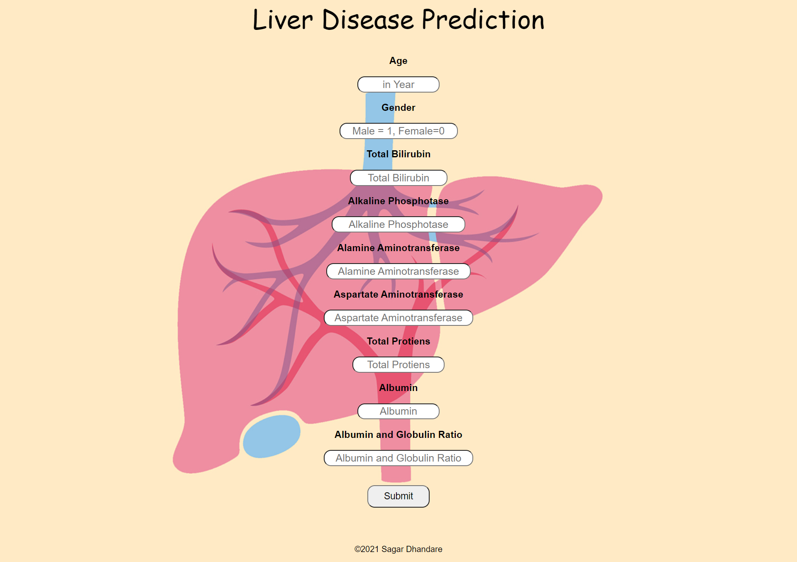

<div align="center">

# Liver Disease Classifier

Predict likelihood of liver disease from clinical parameters using a trained ML model and a simple Flask web app.

[](https://www.python.org/)
[](https://flask.palletsprojects.com/)
[](https://scikit-learn.org/)
[](LICENSE)

</div>

---

## Overview
This repository contains a ready-to-run Flask application that loads a trained model and predicts whether a patient is likely to have liver disease based on standard lab measurements (e.g., bilirubin, enzymes) and demographics. The app provides a simple form UI, validates inputs, and displays the predicted outcome.


## Repository Structure

```text
Liver-Disease-Prediction-Project/
├─ app.py                  # Flask app entrypoint
├─ Liver.py                # Model training / data utilities
├─ Liver.pkl               # Trained model artifact
├─ Liver2.pkl              # (Optional) Alternate model artifact
├─ Dataset/
│  └─ Liver_data.csv       # Dataset used for training/validation
├─ templates/
│  ├─ index.html           # Input form
│  └─ result.html          # Prediction result view
├─ static/                 # Static assets
├─ Images/                 # Screenshots / GIFs
├─ requirements.txt        # Python dependencies
└─ Procfile                # Process declaration (Heroku style)
```

## Clone and Run Locally

1) Clone this repository

```bash
git clone https://github.com/Ayushyadav16/liver_disease_classifier.git
cd liver_disease_classifier
```

2) Create and activate a virtual environment (recommended)

```bash
python -m venv .venv
# Windows PowerShell
.\.venv\Scripts\Activate.ps1
```

3) Install dependencies

```bash
pip install --upgrade pip
pip install -r requirements.txt
```

4) Run the app

```bash
python app.py
```

The app will start on `http://127.0.0.1:5000` unless otherwise configured.

## Input Features (Typical)
- Total Bilirubin, Direct Bilirubin
- Alkaline Phosphatase, Alamine Aminotransferase (ALT), Aspartate Aminotransferase (AST)
- Total Proteins, Albumin, Albumin/Globulin Ratio
- Age, Gender

## Model
- Trained with scikit-learn using the Indian Liver Patient Records dataset.
- Model artifact loaded from `Liver.pkl` at runtime.

## Screenshots



## Deployment

This app can be deployed on most Python-friendly platforms (Render, Railway, Azure, etc.). A `Procfile` is included for Heroku-style process declaration. Typical steps:

1) Ensure `requirements.txt` is up to date.
2) Configure environment (Python version, buildpacks if needed).
3) Start command equivalent to:

```bash
python app.py
```

## Contributing
Contributions are welcome! Feel free to open issues or submit pull requests.

## Acknowledgements
- Dataset: [UCI / Kaggle – Indian Liver Patient Records](https://www.kaggle.com/uciml/indian-liver-patient-records)
- Built with Flask, scikit-learn, and Python.

---

If you find this useful, consider starring the repo. 💙
